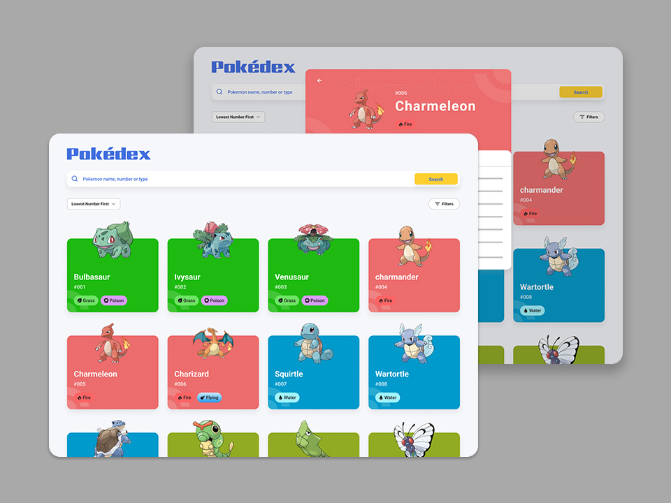

# Pokedex Project

Application to explore and learn more about Pokémon species.

## Project brief

This project involves creating an engaging **Pokedex** application, where users can explore a wide range of Pokémon. It incorporates fetching data from an API, rendering Pokémon cards, and implementing responsive design, search, sorting, and filtering functionalities. Detailed Pokémon information is accessible through interactive cards.

### What is used:

**API Integration and Infinite Loading**: Used the PokéAPI for data retrieval, focusing on pagination and fetching specific Pokémon details.

**Dynamic Rendering and RWD**: Used to render data into cards with adaptive layouts for various screen sizes, including skeleton loading and error handling.

**Interactive Search Panel**: Implemented a search functionality for efficient Pokémon discovery.

**Sorting and Filtering**: Learnt to create dynamic sorting options and multi-criteria filtering for an enhanced user experience.

**Detailed View and Data Handling**: Mastered creating a detailed view for each Pokémon, handling multiple API calls and presenting comprehensive information in a user-friendly format.

### Requirements

- Delve into [PokéAPI](https://pokeapi.co/), focusing on pagination (offset, limit), evolution endpoints, and individual Pokémon data (e.g., pokemon/ditto). Plan loading strategies for optimal UX/UI, considering when and how much data to load.
- Display the 'Pokedex' logo and Pokémon cards, adapting the color based on Pokémon type. Ensure cards include images, names, and numbers. Implement responsive design for different screen sizes, starting with four cards on smaller screens. Include skeleton loading for initial and ongoing data retrieval, plus error handling.
- Develop a smart search panel with an icon, placeholder ("Pokemon name, number or type"), and search button. Update the list after clicking on the button and handle empty search results.
- Add a dropdown for sorting by number and alphabetically, in both ascending and descending order.
- Introduce a multi-checkbox filter for Pokémon types, height, and weight within a drawer. Implement list updates and display active filter counts as well as allow to clearing of the filters.
- Create a detailed view for each Pokémon, accessible by clicking a card. This should include tabs for 'About', 'Base stats', and 'Evolution' (the latter requiring an additional API call). Incorporate loading indicators and error handling, and display background color, number, image, name, type, and other details as per the design. Include a back button to return to the list.

####note####:
All resources are obtained from web dev

